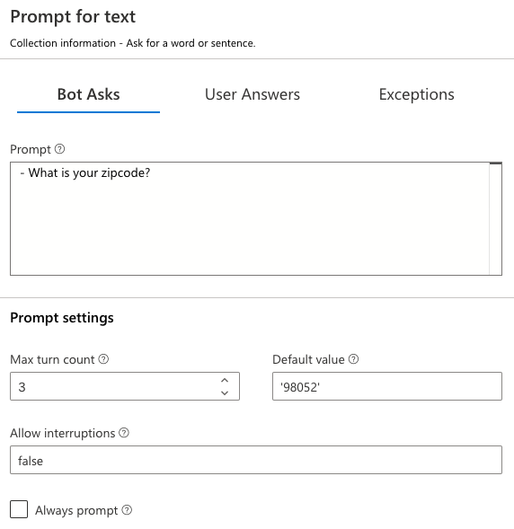
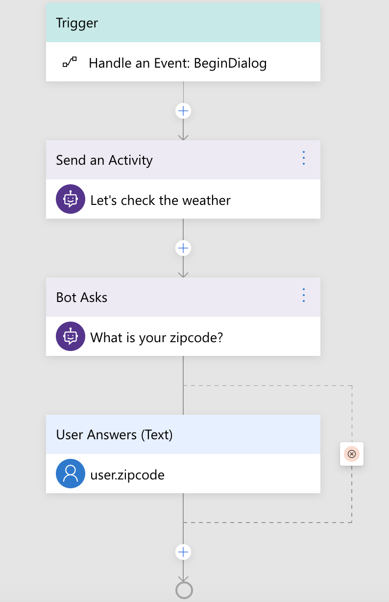
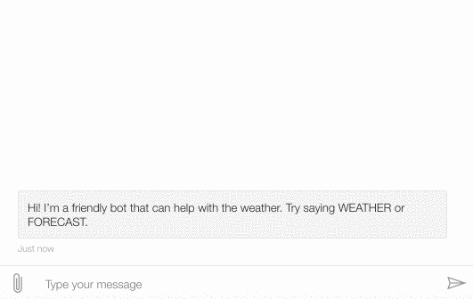

# Get the Weather

1. In the explorer, click on `getWeather` to select the dialog and reveal the triggers it contains.
2. Click on the `BeginDialog` trigger underneath getWeather.

The first thing we need to do to check a user's local weather is collect the user's location. Our weather API accepts a 5 digit zipcode as a parameter.

So, let's prompt the user for a zipcode.

3. Click the "+" button in the flow and select `Ask a Question >`. You'll see a variety of options for asking for different types of input.
4. Select `Prompt for text` from the sub-menu. 2 new nodes will appear in the flow!

     Prompt are broken down into a few pieces. We'll configure each separately.
     


5. Click on the `Bot Asks` node. This part of the prompt represents the message the bot will send to the user requesting information. In the property editor set the prompt to:
```
What is your zipcode?
```



6. Next, click the `User Answers` tab in the property editor. This part of the prompt represents the user's response, including where to store the value and how to pre-process it.


7. Here, we can specify what property in memory will be used to store the user's response. In `Property to fill`, enter the value:
      ```
      user.zipcode
      ```

      For `Output Format`, select `trim`


8. Click on the `Exceptions` tab in the property editor. This section allows you to specify validation rules for the prompt, as well as error messages that will be used if the user provides an invalid response.


9. In the `Unrecognized Prompt` field, enter:
      ```
      - Please specify a zipcode in the form #####
      ```

      In the `Invalid Prompt` field, also enter:
      ```
      - Please specify a zipcode in the form #####
      ```

10. In `Validation Rules`, type:
      ```
      length(turn.value) == 5
      ```

      and then press enter.

      > Make sure to press enter to add the rule!

Your properties pane should look like this:


And your flow should look like this:



With these options set, we have a dialog that will prompt the user for a zipcode. If the user gives a valid 5 digit zipcode, the prompt will store the value in `user.zipcode` and move on. If the user gives an invalid zipcode, the prompt will present an error message and repeat until a valid response is received.

> There are some options in the footer of the prompt properties that can be used to tune how the prompt works.

> Max turn count can be used to control how many times the bot will reprompt after invalid responses.

> By default, prompts will be skip if the bound 
property already has a value. Always prompt, when enabled, will cause the prompt to appear even if the value is already known. Leave this unchecked for now.

After this action occurs, the bot can use {user.zipcode} in messages, and more importantly, in calls to external APIs!

## Add an HTTP request

The http request action is found under the `Integrations >` menu in the flow "+" button.

11. Add an `Http Request` step to your flow.

12. In the properties, editor,

      Set the method to `GET`

      Set the url to:    
        ```
        http://weatherbot-ignite-2019.azurewebsites.net/api/getWeather?zipcode={user.zipcode}
        ```

      Set the property to:
      ```
      dialog.api_response
      ```

13. Add an `IF/ELSE`

14. Set the condition to:
```
dialog.api_response.statusCode == 200
```

15. In the `true` branch, use the "+" button, then select `Memory manipulation >`, then `Set a Property`

      Set Property to:
      ```
      dialog.weather
      ```

      Set Value to:
      ```
      dialog.api_response.content
      ```

16. Still in the `true` branch, use the "+" button, then select `Send Messages >`, then `Send an activity`

    Set the text of the message to:
    ```
    The weather is {dialog.weather.weather} and the temp is {dialog.weather.temp}&deg;
    ```

17. Now, in the `false` branch, use the "+" button, then select `Send Messages >`, then `Send an activity`

    Set the text of the message to:
    ```
    I got an error: { dialog.api_response.content.message }
    ```

18. To be safe, let's clean up the invalid value which otherwise would persist. Use the "+", select `Memory Manipulation >`, then select `Delete a property`

    Set the property to:
    ```
    user.zipcode
    ```

## Test in Emulator

18. Restart the bot again, and open it in emulator.


19. After the greeting, send `weather` to the bot.

The bot will prompt you for a zipcode. Give it your home zipcode, and seconds later, you should see the current weather conditions!



If you ask for the weather again, notice that the bot doesn't prompt for a zipcode the second time. Remember, this is because `user.zipcode` is already set. Had we checked `always prompt,` the bot would ask each time.  Try it out!

